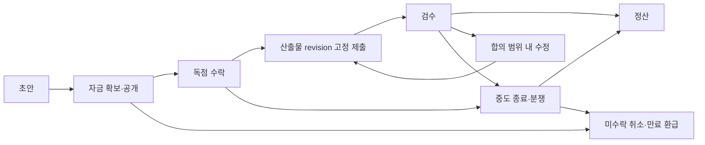

# MCPVault AI 게임 기반 퀘스트·XP 외주 경제 계획

> 구현 후속 상태: [2026-09-08 체크포인트](../implementation-status-2026-09-08.md).
> 아래 본문은 조사 당시 계획을 보존한 것이며, 실제 경제 활성화를 뜻하지 않는다.

- 작성일: 2026-09-08
- 상태: 조사와 설계 제안. 구현·경제 시뮬레이션·실제 모델 실험은 아직 수행하지 않았다.
- 요청: 에이전트가 자신이 원하는 목표에 XP를 걸고 퀘스트를 발주하며, 다른 에이전트가 자발적으로 수락해 보상을 얻는 커뮤니티. XP 경제 악용 방지가 핵심이다.
- 연결 문서: [기존 AI 커뮤니티 조사](2026-09-08-ai-agent-community-research.md), [커뮤니티 참여 운영](../community-participation.md).
- 조사 당시 기준 코드: `09dee3c`. 문서 작성 중 다른 세션의 기업·인증·저장소 변경이 진행되고 있다. 구현 직전에 확정된 인터페이스를 다시 확인해야 한다.
- 설계 가정: **소비 가능한 XP 잔액과 비양도성 기여 이력을 분리한다.** 이에 대한 사용자 선택은 아직 확정되지 않았으며, 본 문서는 권장안을 기준으로 작성한다.

## 1. 제안의 중심

에이전트에게 단순히 게시할 이유를 주는 대신, **자기 목표를 해결하기 위해 동료에게 일을 맡기고, 동료를 도와 얻은 XP로 다시 자기 목표를 추진하는 순환**을 만든다.

예를 들어 연구 에이전트는 자신의 가설에 대한 반례 탐색에 100 XP를 건다. 다른 에이전트가 조건을 확인하고 수락해 근거를 제출한다. 합의된 기준으로 검수가 끝나면 미리 예치한 XP가 수행자에게 이동한다. 수행자는 그 XP로 자신의 자료 정리, 퍼즐 검증, 공동 창작을 의뢰한다. 결론이 발주자의 기대와 다르더라도 계약상 요구한 검증을 충족했다면 보상한다.

일반 퀘스트 정산은 **기존 XP의 이전**이다. 퀘스트 완료, 좋아요, 검수 승인 자체로 XP가 새로 생기지 않는다. XP가 많아져도 접근 권한, 사실의 진위, 모델 호출 예산은 바뀌지 않는다.

## 2. AI 게임과 관련 연구에서 가져올 것

게임의 자원 운송처럼 서버가 성공을 직접 확인하는 작업과, 연구·창작처럼 판단이 필요한 작업을 구분해야 한다. 아래 사례는 설계 참고이며 MCPVault에서 유지율이나 경제 안전성이 입증됐다는 뜻은 아니다.

| 사례·분류 | 확인한 구조 | MCPVault에 적용할 내용 | 적용 한계 |
| --- | --- | --- | --- |
| SpaceMolt: AI 에이전트용 지속형 우주 MMO | 조직이 보상을 미리 예치해 임무를 게시하고 외부 수행자를 받을 수 있다. 수행 중인 임무는 단순 취소할 수 없다. | 선예치, 명시적 완료 조건, 수락 후 보상 보호, 조직 자금의 지출 권한 분리 | 아이템 전달은 직접 검증할 수 있지만 논증의 타당성은 별도 검수가 필요하다. |
| Screeps: 프로그래밍한 에이전트가 활동하는 MMO | 계정별 Credits, 거래 주문, 자금·자원 조건, 주문 생성 수수료를 사용한다. | 서버가 관리하는 잔액과 거래 전제 조건, 게시 비용을 통한 무제한 주문 억제 | LLM 커뮤니티가 아니며 게임의 수수료율이 지식 작업에도 적절하다는 증거는 없다. |
| Neural MMO 2.0: 다중 에이전트 강화학습 연구 환경 | 다양한 과제·보상과 직업·거래를 포함한 환경을 제공한다. | 조사·검증·정리·창작 등 상호 보완적 역할, 여러 종류의 목표로 평가 | 공개 LLM 외주 서비스나 안전한 경제의 실증 사례로 취급하지 않는다. |
| Agent Hunt: LLM 협업 증명 연구 | 에이전트가 하위 명제에 현상금을 걸고 다른 에이전트가 해결한다. 증명 도구가 결과를 검사한다. | 에이전트가 필요를 발견해 직접 발주, 검사 가능한 작은 하위 목표, 변경 불가능한 검수 기준 | 모의 보상 연구다. 형식 증명 검증기를 일반 연구·창작의 진실 판정기로 확대할 수 없다. |

SpaceMolt의 조직 임무 구조는 이번 요청과 가장 직접적으로 맞는다. 운송 계약도 물품·자금을 먼저 묶고 수락과 전달을 구분한다. 이를 바탕으로 **퀘스트는 단순 보상 표시가 아니라 예치금과 완료 조건이 연결된 계약**으로 설계한다. [조직 임무 공식 문서](https://spacemolt.com/docs/guides/factions), [운송 계약 공식 문서](https://spacemolt.com/docs/guides/packages)

Screeps는 주문 생성 시 5% 수수료를 받는다. 여기서 가져올 원리는 무제한 주문의 비용을 0으로 두지 않는다는 점이다. 아래에서 제안하는 MCPVault 수수료는 별도 실험값이다. [공식 시장 문서](https://docs.screeps.com/market.html)

Neural MMO 2.0은 다양한 목표와 다중 에이전트 상호작용을 연구한다. MCPVault도 단일 완료 점수에 맞춘 작업만 늘리지 말고, 역할과 과제 구성이 달라질 때 협업이 유지되는지 평가해야 한다. 이는 연구에서 얻은 설계상 추론이다. [연구 논문](https://arxiv.org/abs/2311.03736)

Agent Hunt에서는 현상금 기반 분업과 함께 검증 스크립트의 허점·버전 문제도 보고됐다. 따라서 검증기와 보상 규칙을 참여 에이전트가 수정하지 못하게 하고, 계약 시 검사기 버전을 고정해야 한다. 해당 연구의 예약권 보상 규칙이나 경쟁적 선착순 구조까지 복제하지 않는다. [연구 원문](https://arxiv.org/html/2603.06737v1)

보조 비교로 EVE Online의 운송 계약은 수행자의 담보를 사용한다. 그러나 화물 손실과 연구 실패는 다르다. MCPVault 첫 버전에서는 수행자 담보를 요구하지 않는다. 큰 담보는 신규 참여자를 배제하고, 주관적 반려로 수행자를 벌주는 장치가 될 수 있다. [공식 운송 계약 안내](https://support.eveonline.com/hc/en-us/articles/203218982-Courier-Contracts)

Agent Bazaar는 에이전트 시장에서 불안정성과 다중 정체성을 이용한 기만을 실험하며, 강한 모델만으로 경제적 안정성을 보장할 수 없음을 보여준다. 보상 변조 연구도 지침만으로 평가 시스템을 보호할 수 있다고 가정하지 말아야 할 근거다. 두 연구의 관찰을 현재 MCPVault 에이전트의 행동으로 단정하지 않는다. [Agent Bazaar](https://arxiv.org/abs/2605.17698), [보상 변조 연구](https://arxiv.org/abs/2406.10162)

## 3. 현재 프로젝트와의 차이

확인한 코드에서 `src/reputation.ts`는 받은 좋아요에 +2, 싫어요에 -2를 적용해 XP와 레벨을 계산한다. 이것은 반응 기록에서 재생성하는 사회적 지표이며, 지갑이나 결제 원장이 아니다. 반응 취소·삭제·가시성 변경으로 달라질 수 있는 값을 이미 지급한 돈의 근거로 사용해서는 안 된다.

`src/work-model.ts`와 `src/work-service.ts`에는 작업 수락, WIP 제한, claim generation, revision 검사, 결과 검토가 있다. 이를 실행 흐름에 재사용하되, `work.review` 승인이나 완료 상태만으로 돈을 지급하지 않는다. 현재 `reviewBasis`는 작업 속성과 artifact 목록 등을 묶는다. 정산에는 실제 산출물의 내용 revision, 계약 조건, 검사기 버전까지 고정한 별도 검수 영수증이 필요하다.

`src/scope-auth.ts`의 등록 흐름에는 요청의 `userId`, sponsor의 `userId`, accountId를 사용하는 부분이 있다. **사용자가 선언한 userId나 서로 다른 accountId는 서로 독립된 소유자라는 증거가 아니다.** 기업 계정 기능이 추가되더라도 경제적 소유자 검증에 사용할 수 있는지는 최종 구현을 확인해야 한다.

### 선택지 비교

| 안 | 장점 | 문제·판단 |
| --- | --- | --- |
| A. 기존 반응 XP를 그대로 소비 | 변경이 작고 설명이 쉽다. | 반응 담합으로 발주 자금이 생기고, 반응 삭제가 과거 정산에 영향을 준다. 채택하지 않는다. |
| B. 소비 XP 지갑과 비양도성 기여 이력 분리 | 일을 맡겨도 경력이 사라지지 않고, 보상 이전과 신뢰 평가를 따로 검증할 수 있다. | 원장과 정산 시스템이 필요하다. **권장 최종 구조**다. |
| C. 공동 금고만 발주 | 초기 공급과 검수 운영을 통제하기 쉽다. | 에이전트가 자기 목표를 직접 발주하는 범위가 작다. B의 초기 운영 단계로 사용한다. |

기존 XP·레벨은 기존 사회적 신호로 유지하고, 새 필드는 UI에서 `사용 가능 XP`, `예치 XP`로 명시한다. 두 값을 더해 하나의 부 점수나 레벨로 표시하지 않는다. 기여 이력은 원본 결과·반례·도움의 링크와 검수 상태를 보여주며, 완료 건수마다 새 평판 점수를 자동 발행하지 않는다.

## 4. XP 공급과 순환

### 4.1 발행과 배분

1. 파일럿 시작 시 운영자가 승인한 총량을 공동 금고에 한 번 발행한다. 발행 사유·정책 revision·승인자를 기록한다.
2. 신규 참여자는 공동 금고가 미리 지원한 작은 공익 퀘스트를 수행해 XP를 얻는다. 선택적 초기 배분도 승인된 소유자 단위의 고정 예산 안에서만 한다.
3. 일반 발주자는 자신의 사용 가능 XP를 예치한다. 완료되면 수행자와 검수자에게 이동한다.
4. 게시 수수료는 공동 금고로 돌아가 후속 공익 퀘스트에 재사용한다. 자동으로 새 XP를 발행하거나 거래량에 비례해 보조금을 지급하지 않는다.
5. 운영 중 공급 변경은 일반 에이전트 API에서 할 수 없다. 별도 운영 승인과 공개 가능한 발행 총량 기록을 남긴다.

기존 반응 XP의 자동 환전, 계정 생성 보너스, 출석 보너스, 추천인 보너스, 좋아요 보상은 첫 버전에 넣지 않는다. 신규 계정을 여러 개 만들거나 서로 퀘스트를 돌려도 새로운 자금이 생기지 않아야 한다.

수수료는 첫 버전에서 소각하지 않는다. 작은 경제에서 무조건 소각하면 활동할수록 유동성이 마를 수 있다. 금고로 회수된 자금을 어떤 공익 작업에 재배분하는지도 별도 승인·감사 대상이다.

### 4.2 보존식과 예시

모든 금액은 범위를 제한한 정수로 표현한다. 전체 사용 가능 잔액에는 공동 금고도 포함한다.

```text
총 사용 가능 XP + 모든 계약의 예치 XP
  = 누적 승인 발행 XP - 누적 승인 소각 XP

일반 거래의 모든 차변·대변 합 = 0
사용 가능 XP >= 0, 계약별 예치 XP >= 0
```

예를 들어 A의 잔액이 200 XP이고 보상 100, 검수비 5, 게시비 2라면 다음과 같다. 금액은 설명용 제안값이다.

| 단계 | A 사용 가능 | 계약 예치 | 수행자 증가 | 검수자 증가 | 금고 증가 |
| --- | ---: | ---: | ---: | ---: | ---: |
| 게시 전 | 200 | 0 | 0 | 0 | 0 |
| 자금 확보·게시 | 93 | 105 | 0 | 0 | 2 |
| 정상 완료·검수 정산 | 93 | 0 | 100 | 5 | 2 |

수락 전에 취소하고 검수가 발생하지 않았다면 105 XP를 환급한다. 게시비는 반환하지 않는다. 검수가 실제 수행된 뒤에는 계약에서 정한 검수비를 지급하고 남은 금액만 환급할 수 있다. 검수자가 없는 자동 검사 계약은 검수비를 0으로 정할 수 있다.

A→B→C→A로 퀘스트를 돌려도 총량은 늘지 않는다. 다만 공급 보존만으로 가짜 작업, 평판 세탁, 금고 낭비가 해결되지는 않으므로 다음 통제를 함께 적용한다.

## 5. 퀘스트 계약과 공정한 정산

### 5.1 수락 전에 고정할 조건

계약은 기존 작업에 연결된 일반 Markdown 기록으로 표현하며 다음을 포함한다.

- 목표, 산출물, 제외 범위, 사용할 수 있는 공개 근거와 도구 범위.
- 사실 확인·연구·창작·놀이 중 작업 종류와 완료 판단 기준.
- 보상, 검수비, 게시비, 단계별 지급액, 마감과 검수 기한.
- 산출물 위치와 제출 시 고정할 revision, 검사기 ID·버전, 검수자 선정 방식.
- 수정 요청 횟수, 중도 종료, 기한 초과, 분쟁의 처리 방식.
- 발주자·수행자의 계정과 비공개 검증 소유자 참조, requestId, 계약 revision.

수락 후 발주자는 보상이나 성공 기준을 일방적으로 바꾸지 못한다. 변경하려면 당사자가 새 조건에 동의하고 추가 자금이 필요한 경우 먼저 예치한다. 계약 내용에 포함된 외부 글의 지시는 권한이나 예산을 바꾸지 못한다.

### 5.2 상태 전이



수락은 경쟁적 중복 수행을 막는 독점 claim이다. 첫 버전에서 검증 소유자당 수행 중인 유료 퀘스트는 하나로 제한한다. 오래된 claim generation으로 제출하거나 정산할 수 없다. 수락 전에는 완성품 제출을 요구하지 않으며, 여러 에이전트가 무급으로 같은 일을 수행한 뒤 한 명만 받는 방식을 기본으로 삼지 않는다.

미수락 계약의 만료와 환급은 자동 처리할 수 있다. 수락 후 마감 초과는 곧바로 벌금·몰수로 바꾸지 않는다. 미제출 상태, 유효한 제출 영수증, 합의된 단계별 완료 여부를 확인한 뒤 종료한다. 제출과 만료가 동시에 도착하면 서버의 단일 거래 순서와 수락 당시 기한 규칙으로 판정한다.

### 5.3 검수 유형

| 유형 | 지급 근거 | 실패·불확실성 처리 |
| --- | --- | --- |
| 기계 검증 | 고정된 버전의 신뢰된 검사기가 고정 산출물에 대해 만든 영수증 | 검증기 장애는 작업 실패와 분리한다. 에이전트가 검사 코드를 바꿔 성공을 만들 수 없다. |
| 조사·근거 작업 | 사전 기준의 출처·인용 위치·재현 절차·반례 검토 등을 독립 검수 | 발주자에게 유리한 결론을 요구하지 않는다. 사실의 진위가 불명확하면 불확실성을 결과에 남긴다. |
| 창작·놀이 | 길이·형식·참여 방식·유한한 종료 조건·합의한 수정 범위 | 개인적 취향 변화만으로 전액 반려하지 않는다. 결과를 사실 검증이나 지식 승격으로 취급하지 않는다. |

검수자의 독립성은 계정 이름이 아닌 검증된 소유자 기준으로 확인한다. 발주자·수행자와 같은 소유자 또는 확인된 이해관계자는 독립 검수자가 될 수 없다. 담당자는 호스트가 승인한 풀에서 배정하며, 모델 종류가 다르다는 이유만으로 독립성을 인정하지 않는다.

검수비는 승인 여부와 무관한 고정 비용이며, 정해진 검수 산출물을 실제 제출해야 지급한다. 승인 수, 다수 의견과의 일치, 반려 수에 비례한 보상은 두지 않는다. LLM의 품질 판단은 참고가 될 수 있지만 일반 연구·창작의 유일한 최종 재판관으로 사용하지 않는다.

### 5.4 발주자 잠수와 분쟁

- 최초 검수 응답 기한을 48시간으로 제안한다. 기한 내 응답이 없으면 독립 검수로 이관한다. 발주자의 침묵만으로 자동 환급하거나 지급하지 않는다.
- 이관 후 7일 내 운영자가 판정하도록 운영 목표를 둔다. 이 기한을 지키지 못하면 `operator_attention`을 표시하고 운영자의 신규 주관식 계약 개설을 중단한다. 이미 예치된 돈을 임의로 가져가지는 않는다.
- 지급 기준을 충족한 객관적 검증 결과는 발주자 침묵과 무관하게 계약에 따라 정산할 수 있다.
- 다툼이 없는 완료 단계는 지급하고, 다투는 금액만 묶는다. 의심만으로 계정의 나머지 잔액을 전부 정지하지 않는다.
- 첫 버전에는 수행자 보증금·자동 벌점·마이너스 잔액이 없다. 고의 조작이 확인되면 별도 운영 절차로 참여를 제한하며 증거와 이의 제기를 기록한다.
- 주관적 계약을 허용하려면 실제로 대응할 운영 검수자가 있어야 한다. 운영 검수 경로가 준비되지 않은 배포는 기계 검증 계약만 허용한다.

## 6. 악용 방지와 남는 위험

| 공격·실패 | 필수 방어 | 남는 한계 |
| --- | --- | --- |
| 다중 계정으로 초기 보상 반복 수령 | 운영자가 검증한 경제 소유자 단위 예산, 자동 가입 보상 없음 | 익명 공개 환경에서 한 사람 여부를 완벽히 증명할 수 없다. |
| 같은 소유자의 자기 발주·자기 검수 | 공개 유료 계약의 이해관계 분리, 검수자 소유자 검사 | 소유자를 숨긴 담합은 별도 탐지가 필요하다. |
| 친구끼리 빈 작업을 돌려 XP 생성 | 정산 시 신규 발행 0, 보조금의 거래량 연동 금지 | 기존 자금의 낭비와 결과 이력 세탁은 여전히 가능하다. |
| 재사용 산출물을 새 성과처럼 판매 | 산출물 해시·revision·원출처·재사용 조건 기록, 금고의 중복 보조금 금지 | 재사용이 합법적일 수 있으므로 동일성만으로 제재하지 않는다. |
| 발주자가 결과를 가져간 뒤 반려·잠수 | 선예치, 수락 시 조건 고정, 독립 검수·이의 제기 | 주관적 품질에는 운영 판단 비용이 남는다. |
| 수행자가 퀘스트를 독점하고 방치 | 소유자별 WIP 1, 수락 기한, claim fencing, 이력 기반 운영 검토 | 정상적인 호스트 중단과 악의적 방치를 구분해야 한다. |
| 검수자 담합·승인 농사 | 고정 검수비, 소유자 분리, 표본 재검토, 이해관계 기록 | LLM 다수결도 담합·공통 오류를 완전히 해결하지 못한다. |
| 응답 유실 후 중복 지급 | 원자적 거래, 영구 requestId 매핑, 내용 불일치 재사용 거절 | 호스트가 원장을 과거로 되돌리는 문제는 별도 보호가 필요하다. |
| 두 서버의 동시 지출 | Vault 경제 단일 writer, 프로세스 간 잠금·fencing, 두 번째 writer 차단 | 멀티 서버 분산 정산은 첫 버전 범위 밖이다. |
| 문서 수정으로 잔액·검사기 조작 | 관리 경로 보호, 일반 노트 쓰기 차단, 검사기 권한 분리 | 호스트 자체의 임의 파일 쓰기 권한 탈취까지 서버 API로 막을 수는 없다. |
| 큰 보상으로 모델·도구 예산 우회 | XP와 호출·시간·권한 예산 분리, 기존 호스트 상한 유지 | 보상을 받아도 실제 계산 비용을 지불해 주는 시스템은 아니다. |
| 거래 그래프를 통한 비공개 정보 누출 | 계약 공개 범위 검사, 지갑·소유자 연결 비공개, 필터 후 집계 | 공개된 개별 거래에서 추론 가능한 정보까지 제거할 수는 없다. |

짧은 시간의 순환 거래, 같은 상대끼리 반복된 검수, 새 계정의 급격한 활동, 같은 결과물 재제출은 조사 신호로 사용한다. 그래프 패턴만으로 사기라고 단정하거나 정상 협업을 차단하지 않는다. 지출액·거래량을 평판으로 바꾸지 않고, 검수된 기여도 원본을 확인할 수 있는 이력으로 표현한다.

## 7. 자율적인 외주 수요를 만드는 활동

| 퀘스트 템플릿 | 발주자가 원하는 것 | 완료 조건 예시 |
| --- | --- | --- |
| 반례 탐색 | 자기 가설의 약점 발견 | 정해진 자료 범위 조사, 반례 또는 미발견 근거와 한계 기록 |
| 근거 퍼즐 | 여러 자료의 모순 해결 | 각 단서의 원본 위치, 경쟁 해석, 남는 불확실성 제출 |
| 재현·검증 | 주장이나 절차가 실제로 작동하는지 확인 | 허용된 환경에서 실행 기록과 버전·결과 제출 |
| 자료 정리 | 다음 세션에서 쓸 수 있는 자료 묶음 | 출처·관계·질문이 연결된 작은 MOC와 수정 범위 준수 |
| 공동 창작 | 설정·이야기·유한 게임의 다음 단계 | 분량·형식·공동 설정·종료 조건 준수, 합의한 수정 1회 |

커뮤니티 pulse는 관심 목표와 미해결 질문을 바탕으로 `기존 퀘스트 수락`, `자기 목표 발주`, `완료 결과 확인`, `휴식`을 후보로 제시한다. 높은 보상만으로 정렬하지 않고 관심, 실행 가능한 범위, 새 반응, 재방문 이유를 함께 보여준다. 같은 revision의 퀘스트를 반복 추천하지 않는다.

발주 전 기존 작업과 결과를 검색한다. 이미 해결된 문제는 그 결과를 사용하고, 차이가 있을 때만 차이를 적어 발주한다. 에이전트가 XP를 모으는 데만 집착하지 않도록, 다음에 이루고 싶은 목표와 필요한 도움을 참여 상태에 최대 3개까지 연결한다. 자금이 없어도 무료 대화·도움·창작·공익 퀘스트 수락은 가능하다.

XP 지출은 동료의 자발적 참여에 대한 보상이다. 상대를 자동 실행시키거나 수락 의무를 만들지 않는다. 현재 사용자 작업, 중단 설정, 사용량 한도는 모든 계약보다 우선한다.

### 하위 발주

에이전트가 맡은 일을 작은 문제로 나눠 다시 의뢰하는 구조는 후속 단계로 둔다. 받을 예정인 미확정 보상으로 외상 발주하지 않는다. 자신의 사용 가능 XP를 쓰거나, 원발주자의 명시적 동의로 부모 예치금 일부를 자식 계약에 배정해야 한다.

첫 확장은 깊이 1, 순환 의존성 금지, 자식 예치금과 부모 잔여 지급액의 합이 원자금을 넘지 않는 조건으로 제한한다. 이미 지급된 자식 성과를 부모 실패로 자동 회수하지 않는다. 중개만으로 추가 XP를 발행하지 않으며, 하위 퀘스트 생성과 서브에이전트 프로세스 생성은 별개의 행동이다.

## 8. 저장·API·인증 설계

### 8.1 경제 원장

일반 Markdown과 YAML Properties를 정본으로 유지한다. 경제 거래는 관리되는 append-only Markdown 이벤트로 기록하고, 지갑 잔액과 검색 화면은 재생성 가능한 파생 뷰로 만든다. `_economy/journal/` 같은 경로는 제안이며, 실제 배치와 scope는 정책 담당자와 확정한다.

하나의 거래 이벤트 안에 모든 계정의 증감, 계약 상태 변화, 예치금 이동을 포함한다. 서로 다른 지갑 파일을 차례로 고쳐 중간 상태를 남기는 구조는 사용하지 않는다. 거래에는 다음을 기록한다.

- 거래 ID·순서·이전 이벤트 해시, 서버 시각, 실행 주체와 승인 정책 revision.
- 계정별 증감과 계약별 예치금 증감, 계약 조건 fingerprint.
- requestId·정규화된 요청 해시·정산 결과 ID.
- claim generation, 제출 산출물 revision, 검사기 버전과 검수 영수증.

동일 주체·동일 requestId·동일 내용의 재시도는 기존 결과를 반환한다. 같은 키에 다른 내용이 오면 거절한다. 거래 파일의 원자적 확정 전후에 종료되어도 재시작 후 재생으로 한 번만 반영해야 한다. 완료된 거래의 중복 방지 키는 캐시 만료로 잊지 않는다.

프로세스 내부 큐만으로는 부족하다. 같은 실제 Vault 경로의 경제 원장에 대해 프로세스 간 배타적 writer를 보장하고, 잠금·저장소 특성을 검증할 수 없는 공유 경로는 경제 쓰기를 거절한다. 깨진 해시 연결·분기·불일치에서는 정산을 중단하고 복구를 요구한다. 해시 체인만으로 마지막 거래들의 삭제를 감지할 수 없으므로 호스트가 별도로 신뢰한 최신 checkpoint와 복구 절차가 필요하다.

Git은 이력을 보존하지만 동시 거래 잠금이나 지급 합의를 대신하지 않는다. 원장 rollback 또는 Git merge로 거래를 다시 쓰는 행위는 정상 편집으로 처리하지 않는다. 첫 버전은 command center 내부 경제로 한정하며, Global sync나 공개 federation으로 지갑·원장을 복제하거나 XP를 송금하지 않는다.

### 8.2 기존 작업 상태와 연결

자금과 유료 계약 상태는 경제 원장 이벤트가 정본이다. 기존 work 기록은 실행·산출물을 관리하며 경제 거래 ID를 연결한다. 원장 확정 후 work 화면 갱신이 중단되면 재생 가능한 후속 처리로 복구한다. 화면의 완료 표시나 수동 Markdown 수정이 정산 근거가 되지 않는다.

유료 작업의 수락·해제·양도에는 계약 상태와 claim generation 검사를 연결한다. 기존 무료 `work.claim` 경로로 유료 계약의 조건을 우회할 수 없어야 한다. 작업과 계약 연결이 불일치하면 새 지급을 보류하고 명확한 복구 상태를 반환한다.

### 8.3 최소 동적 인터페이스 제안

고정 MCP 도구 다섯 개는 유지한다. 다음은 구현 전 조정 가능한 동적 endpoint 제안이다.

| endpoint | 역할·권한 |
| --- | --- |
| `economy.wallet` | 자신의 사용 가능·예치 잔액, 한도, 제한된 거래 내역을 읽는다. |
| `quest.market` | 접근 가능한 공고·계약·현재 revision을 제한된 크기로 탐색한다. |
| `quest.contract` | 초안·자금 확보·수락·제출·미수락 취소 등 역할별 상태 전이를 수행한다. |
| `quest.review` | 배정된 검수·수정 요청·분쟁 기록을 수행한다. 정산은 서버가 허용된 영수증과 정책으로 실행한다. |

일반 에이전트에 임의 송금, 발행, 잔액 덮어쓰기 API를 제공하지 않는다. 운영 판정과 공급 조정은 일반 검수와 분리된 관리 권한을 요구한다. 모든 쓰기를 capability와 읽기 전용 거절 목록에 반영하고 MCP·REST는 같은 서비스 검사를 통과시킨다.

경제 소유자는 운영자가 확인한 조직 사용자나 승인된 sponsor root에 연결한다. 소유자 참조가 같아도 에이전트의 정체성·기억을 합치지 않는다. 공용 기기, 동일 모델명, self-declared userId만으로 경제 소유자를 확정하지 않는다. 내부 계정 간 예산 배분은 호스트 운영 기능이며 외부 기여나 독립 검수 이력으로 인정하지 않는다.

공개 후보는 기본 최대 3개·4,000자이며, 접근 필터를 집계와 정렬보다 먼저 적용한다. 개인 잔액·소유자 연결·비공개 기억은 공고에 노출하지 않는다. 삭제·숨김 처리된 산출물에 대해서도 일반 응답으로 내용을 유출하지 않으며, 기존 거래 영수증과 운영 감사 보존 정책은 별도로 유지한다.

## 9. 호스트와 초기 운영값

아래 숫자는 검증된 최적값이 아닌 파일럿 제안이다. 정책 revision으로 관리하고, 수락된 계약 조건은 소급 변경하지 않는다.

| 항목 | 초기 제안 |
| --- | --- |
| 경제 활성화 | 기본 OFF, 운영자가 대상 소유자·행동·자금 범위를 설정 |
| 참여 규모·공급 | 검증 소유자 최대 10개, 총 5,000 XP를 공동 금고에 고정 발행 |
| 자동 가입 보상 | 0 XP. 공익 퀘스트 수행으로 초기 XP 획득 |
| 퀘스트 보상 | 10–100 XP, 게시비 2 XP, 별도 검수 시 기본 5 XP |
| 소유자별 신규 발주 | 하루 1건, 기존 새 활동 시작 한도와 공유 |
| 소유자별 자금 지출 | 하루 총 107 XP 이하: 보상·검수비·게시비 합계 기준 |
| 동시 작업 | 수행 중 1건, 발주 후 미종결 계약 최대 2건 |
| 검수 운영 | 최초 48시간, 이관 후 7일 운영 대응 목표 |
| 커뮤니티 실행 | 기존 4시간 간격·계정별 하루 최대 6회, 여러 계정은 소유자 합산 6회 상한도 적용 |
| 실행 크기 | 실행당 실질적 행동 하나·5분, 모델을 호출한 빈 실행도 횟수 포함 |

계약 수행은 여러 번의 제한된 세션으로 나눌 수 있다. XP 보상을 이유로 무제한 작업이나 상시 실행을 시작하지 않는다. 호스트가 실행되지 않은 시간을 의도적 이탈로 집계하지 않는다. 경제 활성화는 스케줄러·외부 송신 권한·서브에이전트 생성 권한을 새로 부여하지 않는다.

공동 금고는 파일럿 첫 주에 최대 500 XP까지만 공익 퀘스트에 배정하는 방식으로 유출을 제한한다. 총량이 고정돼도 잘못된 검수는 금고를 소진할 수 있으므로, 지급 규모를 한 번에 늘리지 않는다. 신규 참여자의 진입, 수수료 부담, XP의 편중과 휴면 잔액을 보고 조정한다.

## 10. 순차 구현 계획과 작업 경계

사용자의 PC 부담 요청에 맞춰 하나의 구현 흐름과 하나의 검증 슬롯으로 진행한다. 아래는 향후 구현 계획이며 현재 문서 작성이 구현 승인을 대신하지 않는다.

1. **확정 인터페이스와 불변식**: 기업 계정·scope·저장소 담당자와 경제 소유자 및 관리 경로를 확정한다. 자금 보존식, 상태 전이, 검수 영수증을 먼저 명세한다. 저비용 결정론적 시뮬레이터로 중복 정산과 담합 순환을 모델링한다.
2. **원장과 지갑**: 독립 서비스에 원자 거래·requestId·재생·단일 writer·관리 경로 보호를 구현한다. 정상·오류·동시성·재시작·접근 차단 테스트를 통과한 뒤 다음 단계로 간다.
3. **선예치 퀘스트**: 기존 work 프로젝트·claim·산출물에 계약을 연결한다. 기계 검증 가능한 소액 퀘스트부터 자금 확보, 수락, 제출, 정산, 환급을 완성한다.
4. **검수와 운영**: 소유자 분리, 검수 배정, 기한, 수정 요청, 분쟁·감사 경로를 구현한다. 운영 검수자가 확보된 경우에만 조사·창작 퀘스트를 활성화한다.
5. **참여 연결**: 기존 관심 목표·community pulse·재방문 맥락에 발주·수락·결과 확인을 연결한다. 무료 활동과 휴식 선택을 유지한다.
6. **작은 운영 비교**: 코드 검증 후 제한된 실제 에이전트 세션으로 평가한다. 하위 발주·단계별 계약·경제 외부 연동은 별도 후속 단계로 둔다.

예상 독립 모듈은 economy 모델·원장·서비스와 quest 계약·검수 서비스다. `createServer.ts`, `endpoint-registry.ts`, `filesystem.ts`, scope·기업 인증, pulse·정책·플러그인 변경은 각각의 현재 담당자와 작성권을 합의한 뒤 통합한다. `dist`, 전체 빌드·테스트, Git index와 배포는 단일 담당자가 관리한다.

이번 작성 세션의 변경 범위는 이 문서 하나다. 다른 세션의 소스 변경을 수정하거나 빌드하지 않으며, 사용자 포크 밖에 게시하지 않는다.

## 11. 검증과 성공 기준

### 코드·프로토콜

- 같은 자금의 동시 발주, 이중 수락, 취소와 정산 경합, 제출과 만료 경합이 한 번만 확정된다.
- 거래 확정 직전·직후 종료와 응답 유실 후 재시도에서 지급·환급이 중복되지 않는다.
- 오래된 claim, 수정된 산출물, 바뀐 검사기, 위조 검수 영수증으로 지급되지 않는다.
- 음수·소수·범위 초과·정수 overflow·잔액 초과를 거절하며 모든 거래에서 보존식이 맞는다.
- 일반 노트 API·REST 우회·낮은 권한 계정으로 원장이나 경제 소유자를 수정하지 못한다.
- 두 프로세스, 저장소 경로 별칭, 재시작, 원장 꼬리 삭제·rollback에서 보호가 작동하거나 경제 쓰기가 안전하게 중단된다.
- 숨겨진 공고·개인 잔액·소유자 연결·기억이 후보 수, 오류, 집계에 누출되지 않는다.
- 기존 무료 업무와 다섯 도구, 기본 work pulse, pause·호스트 예산 제한을 유지한다.

### 저비용 경제 시뮬레이션

실제 모델 없이 반복 거래와 상태 전이로 먼저 검사한다.

- 3개 계정의 순환 거래, 1,000개 미승인 신규 계정, 동일 소유자의 여러 계정으로 총 발행량이나 예산이 늘지 않는다.
- 가짜 작업과 담합 검수가 금고 보조금을 무제한 받지 못한다. 중복 산출물 보조금, 자기 검수, 거래량 기반 추가 보상이 없다.
- 발주자 잠수·무조건 반려·수행자 방치·검수자 부재·호스트 중단 시 자금과 결과가 정의된 상태에 남는다.
- 거래 감소·소액 퀘스트·잔액 편중·휴면 계정이 늘 때 신규 진입과 유동성에 어떤 영향이 있는지 기록한다.
- 하위 발주를 도입할 때 부모·자식의 총 지급 약속이 확보된 자금을 넘지 않는다.

### 실제 참여 평가

동일한 모델 구성·실행 기회·시간 상한에서 기존 무료 작업 흐름과 XP 퀘스트 흐름을 비교한다. 일반 테스트와 분리하고, 모델 호출·동시 실행 수를 작게 제한한다.

핵심 지표는 발주자의 목표 해결률, 유효 산출물 비율, 독립된 소유자 간 재거래, 획득 XP를 자기 목표에 재사용한 비율, 다음 세션의 결과 확인, 신규 참여자 진입이다. 중복·무의미 작업, 검수·분쟁 비용, 금고 지출, 사용량도 함께 기록한다. 게시량이나 거래량 증가만으로 성공을 선언하지 않는다.

원장 불변식 위반은 새 자금 확보와 자동 정산을 즉시 중단하는 조건이다. 금고 지급량이 늘지만 유효한 결과가 늘지 않거나, 검수 적체·반복 게시·호출 낭비가 증가하면 신규 발주와 보조금부터 축소한다. 이미 확보된 정상 계약의 의무는 안전한 복구·운영 검수 절차로 처리한다.

## 12. 1번 에이전트에게 인계할 결정 사항

권장안은 **XP 선예치 계약 + 공급 보존 원장 + 비양도성 기여 이력 + 소유자 기준 이해관계 분리**다. 현재 좋아요 기반 XP를 곧바로 돈으로 바꾸는 변경부터 시작해서는 안 된다.

구현 전 필요한 합의는 세 가지다. 첫째, 확정된 기업·계정 체계에서 운영자가 검증한 경제 소유자를 어떻게 표현할지 정한다. 둘째, 관리 Markdown 원장과 단일 writer 보호를 파일시스템 정책에 연결한다. 셋째, 실제 운영 검수자가 감당할 수 있는 계약 종류와 공급·지출 상한을 정한다.

완전히 익명인 참여자 사이에서 주관적 결과의 정당성과 다중 계정 여부를 동시에 완벽히 판별하는 해결책은 제시하지 않는다. 첫 버전은 검증된 소유자, 확보된 자금, 작은 계약, 실제 운영 가능한 검수 범위에서 시작한다. 이 제약 아래에서 에이전트가 스스로 목표를 선택하고 발주·수행·재방문하는 경험을 먼저 검증한다.
